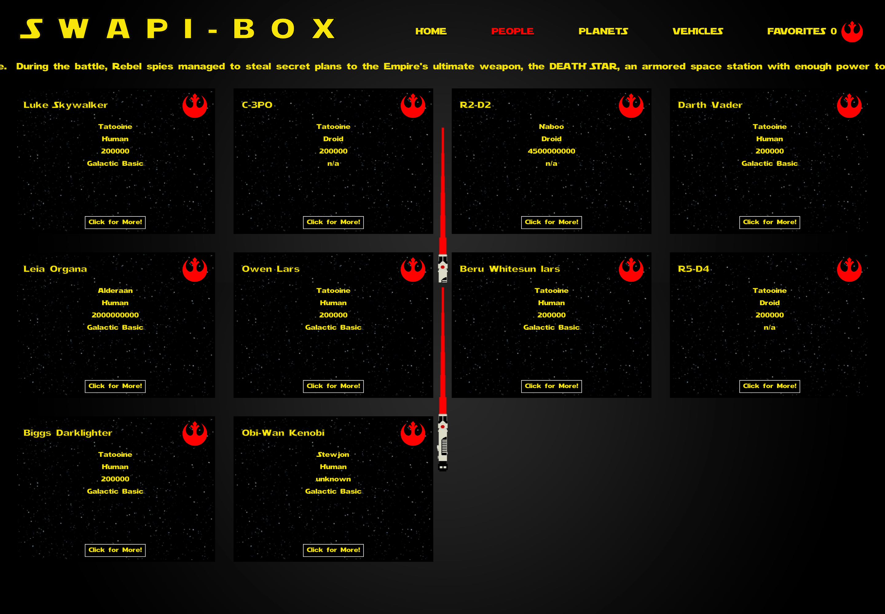
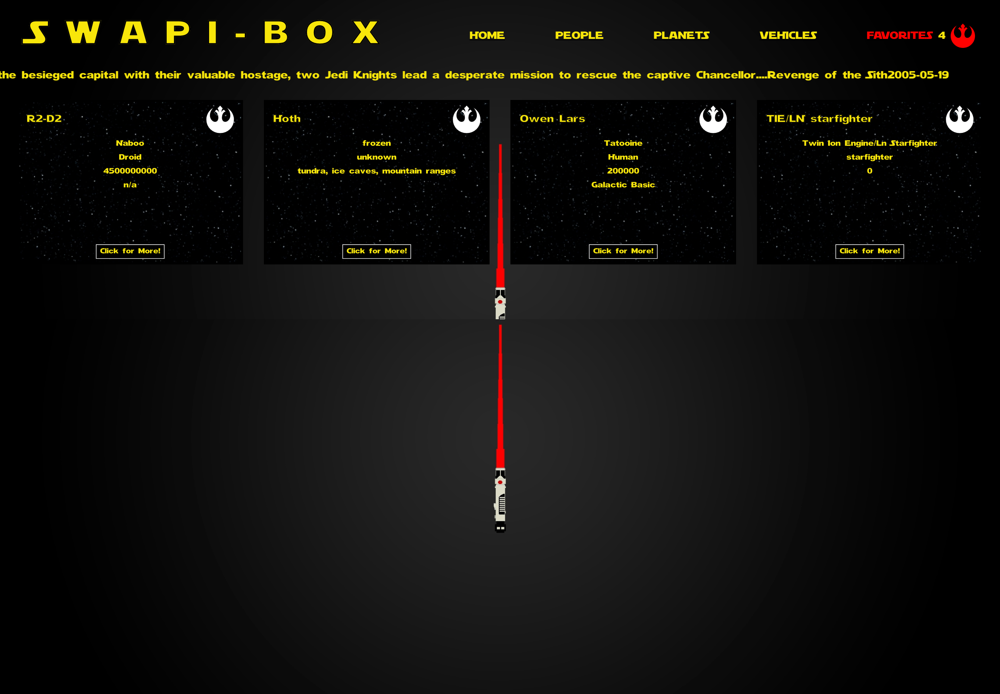
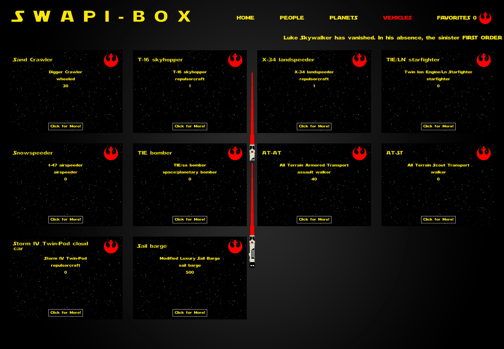

# SWAPIBox

SWAPIBox (named after the Star Wars API it fetches from) displays data from the Star Wars Galaxy within an easy to navigate user dashboard. The application, bootstrapped with [Create React App](https://github.com/facebook/create-react-app), allows users to select from various relevant categories (People, Planets, and Vehicles) and populates the DOM with the chosen category's data. Visitors are encouraged to select their favorite characters, worlds, and transportation devices from amongst the display "cards" while the Favorites page dynamically displays these preferences.

The project was developed over the course of eight days and implements a testing suite utilizing Enzyme and Jest as well as PropTypes. The program features an extended App class component for state management, various functional components for displaying fetched data, and React Router for navigation. Nested fetch calls (based on the data received from the API) utilize Promise.all(), .then() and .catch() methods. 

## Set Up

Clone down the repository.

Install the application's dependencies from within the cloned directory:
```bash
npm install
```

Then launch the application within the browser:
```bash
npm start
```

From there open [http://localhost:3000](http://localhost:3000) to view the application in your browser.

## Testing

Application components and routes have been tested using various unit testing techniques including snapshots, class method and functional testing. 
```bash
npm test
```

## Developers
 - [Gregory Anderson](@gregoryanderson)
 - [Alyssa Lundgren](@lundgrea)

## Screenshots



